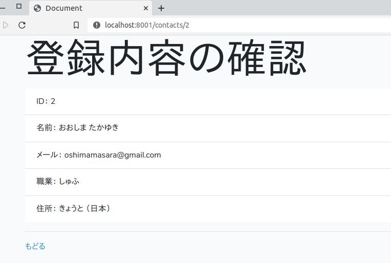

## index screen


## add screen


## check screen


## 環境

+ PHP 7.*
+ Composer
+ Laravel
+ Node.js
+ MySQL
  
## 準備

create db
+ check file --> laravel-crud/.env
+ edit file --> DB_DATABASE, DB_NAME, DB_PASSWORD  etc

cd laravel-crud

```
php artisan make:model Contact --migration
php artisan migrate
```

+ edit file --> app/Contact.php 

```
<?php
namespace App;
use Illuminate\Database\Eloquent\Model;
class Contact extends Model
{
    protected $fillable = [
        'first_name',
        'last_name',
        'email',
        'city',
        'country',
        'job_title'       
    ];
}
```

## RUN

php artisan serve

